---

<h2 align="center">⚙️ Tech Stack</h2>

<table align="center">
  <tr>
    <td align="center"><b>Languages</b></td>
    <td></td>
  </tr>
  <tr>
    <td align="center"><b>Frameworks</b></td>
    <td></td>
  </tr>
  <tr>
    <td align="center"><b>Databases</b></td>
    <td></td>
  </tr>
  <tr>
    <td align="center"><b>Tools & DevOps</b></td>
    <td></td>
  </tr>
  <tr>
    <td align="center"><b>Operating Systems</b></td>
    <td></td>
  </tr>
</table>

---

<h2 align="center">🧠 About me</h2>

Developer from Germany. 
I build Discord bots, websites and FiveM scripts, and I host most of it myself on a homelab rack I put together piece by piece.

---

<h2 align="center">🚀 Projects</h2>

<table align="center">
  <tr>
    <td align="center"><b>🐙&nbsp;<a href="https://getocto.gg">Octo</a></b></td>
    <td>Multipurpose Discord bot with a web dashboard: music, logging, captcha verification, 6 languages</td>
  </tr>
  <tr>
    <td align="center"><b>🏙️&nbsp;District</b></td>
    <td>German FiveM roleplay server, plus District Development, my own ESX script suite (inventory, shop, crafting)</td>
  </tr>
</table>

---

<h2 align="center">🖥️ Homelab</h2>

  

---

  
  
  

